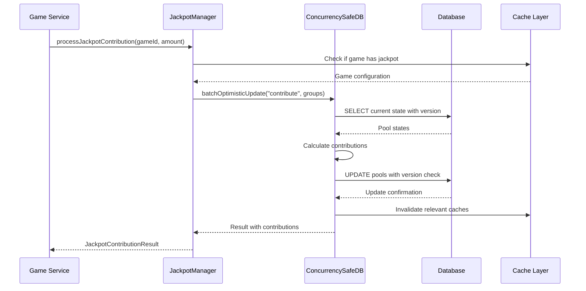
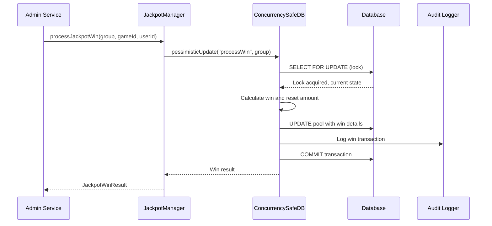

# Jackpot Service Architecture

## Overview

The Jackpot Service has been refactored from a simple in-memory implementation to a robust, database-backed system with comprehensive concurrency control, performance optimizations, and monitoring capabilities. This document describes the system architecture, design patterns, and implementation details.

## System Architecture

### High-Level Architecture

```
┌─────────────────────────────────────────────────────────────┐
│                    Application Layer                        │
├─────────────────────────────────────────────────────────────┤
│  Game Services  │  Admin Services  │  Monitoring Services   │
├─────────────────────────────────────────────────────────────┤
│                  Jackpot Service Layer                      │
├─────────────────────────────────────────────────────────────┤
│  ┌─────────────┐ ┌─────────────┐ ┌─────────────┐ ┌─────────┐ │
│  │JackpotManager│ │Concurrency  │ │Performance  │ │ Caching │ │
│  │             │ │   SafeDB    │ │  Monitor    │ │  Layer  │ │
│  └─────────────┘ └─────────────┘ └─────────────┘ └─────────┘ │
├─────────────────────────────────────────────────────────────┤
│               Database Layer (PostgreSQL)                   │
├─────────────────────────────────────────────────────────────┤
│  ┌─────────────┐ ┌─────────────┐ ┌─────────────┐ ┌─────────┐ │
│  │ Jackpot     │ │ Transaction │ │   Audit     │ │  Lock   │ │
│  │    Table    │ │    Log      │ │    Log      │ │ Manager │ │
│  └─────────────┘ └─────────────┘ └─────────────┘ └─────────┘ │
└─────────────────────────────────────────────────────────────┘
```

### Core Components

#### 1. JackpotManager
**Purpose**: Main orchestration service for jackpot operations
**Responsibilities**:
- Initialize and maintain jackpot pools
- Process contributions and wins
- Manage configuration changes
- Coordinate database operations
- Ensure data consistency

**Key Features**:
- Automatic pool initialization
- Transaction coordination
- Error handling and recovery
- Configuration validation

#### 2. ConcurrencySafeDB
**Purpose**: Provides safe database operations with concurrency control
**Responsibilities**:
- Optimistic locking with version control
- Pessimistic locking for critical operations
- Automatic retry logic
- Conflict resolution

**Implementation**:
```typescript
class ConcurrencySafeDB {
  static async optimisticUpdate<T>(
    operation: string,
    group: JackpotGroup,
    updateFn: (pool: any, tx: any) => Promise<T>
  ): Promise<ConcurrencySafeResult<T>>
  
  static async pessimisticUpdate<T>(
    operation: string,
    group: JackpotGroup,
    updateFn: (pool: any, tx: any) => Promise<T>
  ): Promise<ConcurrencySafeResult<T>>
  
  static async batchOptimisticUpdate<T>(
    operation: string,
    groups: JackpotGroup[],
    updateFn: (pools: any[], tx: any) => Promise<T>
  ): Promise<ConcurrencySafeResult<T>>
}
```

#### 3. Performance Monitor
**Purpose**: Real-time monitoring and performance optimization
**Responsibilities**:
- Collect performance metrics
- Monitor database performance
- Track query execution times
- Detect performance bottlenecks
- Generate alerts

#### 4. Caching Layer
**Purpose**: Intelligent caching for frequently accessed data
**Features**:
- Multi-level caching strategy
- Automatic cache invalidation
- TTL-based expiration
- Memory-efficient storage

## Database Schema Design

### Jackpot Table Structure

```sql
CREATE TABLE jackpots (
  id UUID PRIMARY KEY DEFAULT gen_random_uuid(),
  group JACKPOT_GROUP NOT NULL, -- 'minor', 'major', 'mega'
  current_amount INTEGER NOT NULL, -- Current pool amount (cents)
  seed_amount INTEGER NOT NULL, -- Reset amount when won
  max_amount INTEGER, -- Optional maximum cap
  contribution_rate REAL NOT NULL, -- 0.0 to 1.0
  min_bet INTEGER, -- Minimum bet requirement
  last_won_amount INTEGER, -- Last win amount
  last_won_at TIMESTAMPTZ(3), -- Last win timestamp
  last_won_by_user_id UUID REFERENCES users(id),
  total_contributions INTEGER DEFAULT 0, -- Running total
  total_wins INTEGER DEFAULT 0, -- Running total
  jackpot_wins JSONB DEFAULT '[]', -- Win history array
  contribution_history JSONB DEFAULT '[]', -- Contribution history
  version INTEGER DEFAULT 0 NOT NULL, -- Optimistic locking
  lock_holder TEXT, -- Current lock holder (debug)
  last_modified_at TIMESTAMPTZ(3), -- Timestamp-based locking
  created_at TIMESTAMPTZ(3) NOT NULL DEFAULT NOW(),
  updated_at TIMESTAMPTZ(3) NOT NULL DEFAULT NOW()
);
```

### Performance Indexes

```sql
-- Primary access patterns
CREATE INDEX idx_jackpots_group ON jackpots (group);
CREATE INDEX idx_jackpots_version ON jackpots (version);
CREATE INDEX idx_jackpots_last_modified ON jackpots (last_modified_at);

-- Composite indexes for common queries
CREATE INDEX idx_jackpots_group_version ON jackpots (group, version);

-- Partial indexes for active jackpots
CREATE INDEX idx_jackpots_active_groups ON jackpots (group) WHERE current_amount > 0;

-- JSONB indexes for history queries
CREATE INDEX idx_jackpots_contribution_history ON jackpots USING gin (contribution_history);
CREATE INDEX idx_jackpots_win_history ON jackpots USING gin (win_history);
```

### Constraints and Data Integrity

```sql
-- Data integrity constraints
ALTER TABLE jackpots 
ADD CONSTRAINT jackpots_amounts_positive 
CHECK (current_amount >= 0 AND seed_amount >= 0 AND (max_amount IS NULL OR max_amount >= 0)),
ADD CONSTRAINT jackpots_contribution_rate_valid 
CHECK (contribution_rate >= 0 AND contribution_rate <= 1),
ADD CONSTRAINT jackpots_max_amount_valid 
CHECK (max_amount IS NULL OR max_amount >= seed_amount);

-- Unique constraint for jackpot groups
ALTER TABLE jackpots 
ADD CONSTRAINT jackpots_group_unique UNIQUE (group);
```

## Concurrency Control Strategy

### Optimistic Locking

**Implementation**:
- Version column tracks concurrent modifications
- Compare versions before updates
- Retry on version conflicts
- Automatic conflict resolution

**Workflow**:
1. Read current pool state with version
2. Perform business logic calculations
3. Update with version check: `WHERE version = @original_version`
4. If update affects 0 rows, version conflict occurred
5. Retry with new version

```typescript
// Example optimistic update
const result = await db.transaction(async (tx) => {
  const pools = await tx.select().from(jackpotTable)
    .where(eq(jackpotTable.group, group));
  
  const pool = pools[0];
  const originalVersion = pool.version;
  
  // Perform update
  await tx.update(jackpotTable)
    .set({
      currentAmount: sql`current_amount + ${contribution}`,
      version: sql`version + 1`
    })
    .where(and(
      eq(jackpotTable.group, group),
      eq(jackpotTable.version, originalVersion) // Version check
    ));
    
  // Check if update succeeded
  const updateResult = await tx.select().from(jackpotTable)
    .where(eq(jackpotTable.group, group));
    
  if (updateResult[0].version !== originalVersion + 1) {
    throw new ConcurrencyViolationError('Version conflict');
  }
});
```

### Pessimistic Locking

**Use Cases**:
- Win processing (critical operation)
- Configuration updates
- System maintenance operations

**Implementation**:
- Lock holder tracking
- Timeout mechanisms
- Deadlock prevention

### Batch Operations

**Purpose**: Efficient processing of multiple groups
**Features**:
- Atomic updates across multiple pools
- Consistent state management
- Optimized database queries

## Data Flow Architecture

### Contribution Processing Flow



### Win Processing Flow



## Performance Optimization Architecture

### Query Optimization

1. **Prepared Statements**
   - Reused query plans
   - Reduced parsing overhead
   - Optimized execution paths

2. **Batch Queries**
   - Multiple group updates in single query
   - Reduced database round trips
   - Improved throughput

3. **Index Optimization**
   - Strategic index placement
   - Query pattern alignment
   - Maintenance strategies

### Caching Strategy

#### Multi-Level Caching

```
┌─────────────────────────────────────────────────┐
│                Application Cache               │
│              (In-Memory, Fastest)              │
├─────────────────────────────────────────────────┤
│               Database Cache                   │
│             (Query Result Cache)               │
├─────────────────────────────────────────────────┤
│                Disk Cache                      │
│            (Persistent Storage)                │
└─────────────────────────────────────────────────┘
```

#### Cache Invalidation

- **Time-based**: TTL expiration
- **Event-based**: Database change notifications
- **Pattern-based**: Intelligent cache key patterns

### Memory Management

#### Stream Processing
```typescript
// Large dataset processing
const streamProcessor = createStreamProcessor({
  batchSize: 100,
  maxMemoryUsage: 50 * 1024 * 1024, // 50MB
});

for await (const contribution of largeDataset) {
  await streamProcessor.process(contribution);
}
```

#### Memory Efficient Storage
- JSONB compressed storage
- Selective field loading
- Garbage collection optimization

## Error Handling Architecture

### Error Categorization

1. **Transient Errors**
   - Database connection issues
   - Network timeouts
   - Temporary resource unavailability
   
2. **Permanent Errors**
   - Invalid input data
   - Business rule violations
   - Configuration errors

3. **Concurrency Errors**
   - Version conflicts
   - Deadlocks
   - Lock timeouts

### Retry Strategy

```typescript
interface RetryPolicy {
  maxAttempts: number;
  baseDelay: number;
  maxDelay: number;
  backoffMultiplier: number;
  jitter: boolean;
}

// Exponential backoff with jitter
const delays = [100, 200, 400, 800, 1600]; // Base delays
delays.forEach(delay => delay + randomJitter());
```

### Circuit Breaker Pattern

```typescript
class CircuitBreaker {
  private state: 'CLOSED' | 'OPEN' | 'HALF_OPEN' = 'CLOSED';
  private failureCount = 0;
  private lastFailureTime = 0;
  
  async execute<T>(operation: () => Promise<T>): Promise<T> {
    if (this.state === 'OPEN') {
      if (Date.now() - this.lastFailureTime > this.timeout) {
        this.state = 'HALF_OPEN';
      } else {
        throw new Error('Circuit breaker is OPEN');
      }
    }
    
    try {
      const result = await operation();
      this.onSuccess();
      return result;
    } catch (error) {
      this.onFailure();
      throw error;
    }
  }
}
```

## Monitoring and Observability

### Metrics Collection

#### Performance Metrics
- Query execution times
- Database connection usage
- Cache hit/miss ratios
- Memory usage patterns

#### Business Metrics
- Contribution processing rates
- Win distribution patterns
- Pool growth rates
- User engagement metrics

#### Health Metrics
- Database connectivity
- Service availability
- Error rates
- System resource usage

### Logging Strategy

#### Structured Logging
```typescript
interface LogEntry {
  timestamp: string;
  level: 'INFO' | 'WARN' | 'ERROR' | 'DEBUG';
  service: string;
  operation: string;
  correlationId: string;
  userId?: string;
  gameId?: string;
  data: Record<string, any>;
}
```

#### Audit Trail
- All jackpot operations logged
- Configuration changes tracked
- User actions recorded
- System events captured

### Alerting

#### Alert Categories
1. **Critical Alerts**
   - Database connectivity loss
   - Service unavailability
   - Data corruption detected

2. **Warning Alerts**
   - High error rates
   - Performance degradation
   - Resource threshold exceeded

3. **Info Alerts**
   - Successful migrations
   - Configuration updates
   - System health checks

## Security Architecture

### Authentication & Authorization

1. **Service Authentication**
   - JWT tokens for service-to-service auth
   - Role-based access control
   - API key management

2. **Data Protection**
   - Input validation with Zod schemas
   - SQL injection prevention
   - XSS protection

3. **Audit Security**
   - Tamper-proof audit logs
   - Access control for audit data
   - Compliance reporting

### Data Integrity

1. **Database Level**
   - Foreign key constraints
   - Check constraints
   - Unique constraints

2. **Application Level**
   - Validation layers
   - Business rule enforcement
   - Consistency checks

## Deployment Architecture

### Environment Strategy

```
┌─────────────────────────────────────────────────┐
│              Development Environment            │
│               (Local Testing)                   │
├─────────────────────────────────────────────────┤
│              Staging Environment                │
│             (Integration Testing)              │
├─────────────────────────────────────────────────┤
│              Production Environment             │
│              (Live Operations)                  │
└─────────────────────────────────────────────────┘
```

### Database Migrations

#### Migration Strategy
1. **Forward Migrations**: Schema updates
2. **Rollback Migrations**: Undo changes
3. **Data Migrations**: Transform existing data
4. **Validation Migrations**: Verify integrity

#### Migration Safety
- Transactional migrations
- Rollback procedures
- Data backup strategies
- Validation checks

### Monitoring Deployment

#### Health Checks
- Database connectivity
- Cache availability
- Service responsiveness
- Resource usage

#### Load Balancing
- Connection pooling
- Query load distribution
- Failover mechanisms
- Performance monitoring

## Scalability Considerations

### Horizontal Scaling

1. **Read Replicas**
   - Query load distribution
   - Read performance optimization
   - Geographic distribution

2. **Connection Pooling**
   - Database connection management
   - Connection reuse optimization
   - Pool sizing strategies

### Vertical Scaling

1. **Resource Optimization**
   - Query performance tuning
   - Index optimization
   - Memory usage optimization

2. **Database Tuning**
   - Configuration optimization
   - Performance parameter tuning
   - Storage optimization

## Future Architecture Enhancements

### Planned Improvements

1. **Microservices Decomposition**
   - Separate service for jackpot operations
   - Independent scaling capabilities
   - Service mesh integration

2. **Event-Driven Architecture**
   - Event sourcing for jackpot operations
   - CQRS pattern implementation
   - Event stream processing

3. **Advanced Caching**
   - Redis integration
   - Distributed cache layer
   - Cache consistency strategies

4. **Machine Learning Integration**
   - Predictive analytics
   - Anomaly detection
   - Automated optimization

### Technology Roadmap

1. **Short Term (Q1 2025)**
   - Performance optimization
   - Monitoring enhancement
   - Security hardening

2. **Medium Term (Q2-Q3 2025)**
   - Microservices migration
   - Event sourcing implementation
   - Advanced analytics

3. **Long Term (Q4 2025+)**
   - AI-driven optimization
   - Multi-region deployment
   - Advanced security features

---

*This architecture documentation reflects the current system design and is updated as the system evolves.*